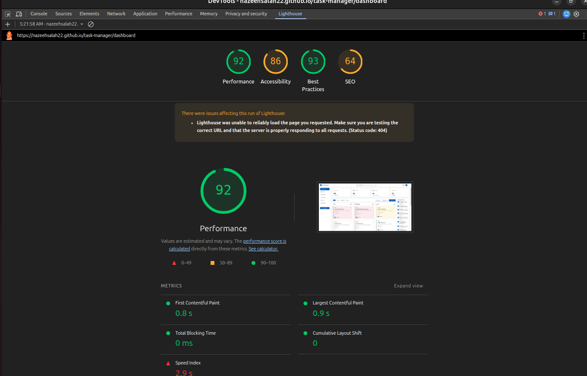

# Task Manager Dashboard

A modern, feature-rich **Task Management Dashboard** built with **Angular 21**, leveraging cutting-edge framework capabilities including Standalone Components, Signals, and the experimental `HttpResource` API.

## Project Overview

The Task Manager Dashboard is a single-page application that enables teams to manage tasks across a Kanban-style board, track performance via analytics charts, and perform real-time filtering of tasks by status, priority, and assignee.

### Key Features

- **Kanban Board** — Drag or move tasks across `Todo`, `In Progress`, `In Review`, and `Done` columns
- **Analytics Dashboard** — Visual breakdown of task distributions using Chart.js
- **Live Search & Filtering** — Filter tasks by status, priority, and assignee with debounced search
- **Full CRUD** — Create, edit, and delete tasks via Material dialogs
- **Statistics Cards** — At-a-glance summaries of task counts and completion rates
- **Recent Activity Feed** — Live feed of the latest task updates
- **GitHub Pages Deployment** — Automated CI/CD pipeline via GitHub Actions

## Architecture
### Component Architecture
The app uses **100% Standalone Components** (no NgModules), aligned with modern Angular best practices. All components are self-contained with their own imports, enabling better tree-shaking and faster compilation.

- **`core/`** — Singleton services, models, interceptors
  - `interceptors/` — HTTP interceptors (error handling, mock backend)
  - `models/` — TypeScript interfaces (`Task`, `Statistic`)
  - `services/` — `TaskService`, `SearchService`
- **`dashboard/`** — Main dashboard feature area
  - `components/`
      - `stat-card/` — Summary statistic cards
      - `task-board/` — Kanban board container
      - `task-card/` — Individual task card
      - `task-analytics/` — Charts & analytics page
      - `recent-activity/` — Activity feed
      - `toolbar/` — Search & filter toolbar
    - `dashboard.ts` — Root dashboard component
- **`layout/`** — Shell layout (sidebar & router outlet)
- **`shared/`** — Reusable UI components
  - `dialogs/` — `TaskFormDialog`, `ConfirmDialog`
  - `spinner/` — Loading indicator
  - `no-data/` — Empty state UI
- **`app.routes.ts`** — Lazy-loaded route configuration

### Lazy Loading

All feature routes are **lazy-loaded** using `loadComponent()`, keeping the initial bundle small:

- **`/dashboard`** — Lazy loads `Dashboard` component from `./dashboard/dashboard`
- **`/analytics`** — Lazy loads `TaskAnalytics` component from `./dashboard/components/task-analytics/task-analytics`
- **`/**`** — Wildcard redirects to `/dashboard`

### Change Detection
All components use **`ChangeDetectionStrategy.OnPush`** to minimize re-renders. Combined with Signals, the framework only re-renders when reactive state actually changes.

## Setup & Installation
### Prerequisites

- **Node.js** — 20.x or later
- **npm** — 10.x or later
- **Angular CLI** — 21.x

### Steps (Local Development)

1. Clone the repository: `git clone https://github.com/nazeehsalah22/task-manager.git`
2. Navigate to the project: `cd task-manager/task-manager`
3. Install dependencies: `npm install`
4. Start the app: `npm start`

Open your browser at `http://localhost:4200`.

---

## Environment Configuration

Environment files are located in `src/environments/`:

- `environment.ts` — Production (default build)
- `environment.dev.ts` — Local development
- `environment.prod.ts` — Explicit production override

### Configuration options

- `production` — Enables/disables production optimizations
- `apiUrl` — Base URL for the REST API (e.g. `http://localhost:3000`)
- `useMockBackend` — Set to `true` to use the in-memory mock; `false` to use a real JSON server

> **Note:** Set `useMockBackend: true` to run the app fully offline with no external backend dependency. Data is persisted in `localStorage`.

## Available Scripts

- `npm start` — Run development server at `http://localhost:4200`
- `npm run mock-api` — Start json-server REST API at `http://localhost:3000`
- `npm run build` — Production build to `dist/task-manager/browser/`
- `npm run watch` — Dev build with file-watching (development config)
- `npm test` — Run unit tests via Vitest
- `npm run test:coverage` — Run tests and generate a coverage report

---

## Design Patterns & State Management

### Signals — Reactive State

Local UI state is managed using Angular **Signals**, eliminating the need for an external state library:

- `selectedStatus` — tracks the active status filter (`'all'` by default)
- `selectedPriority` — tracks the active priority filter (`'all'` by default)
- `selectedAssignees` — tracks the list of selected assignee IDs (empty by default)

Signals integrate natively with the Angular change detection system, triggering UI updates only when values actually change.

### API

Remote data fetching uses Angular experimental **`httpResource`** API, which automatically returns a reactive resource (with `value()`, `isLoading()`, and `error()` signals):

- `tasksResource` — fetches the full task list from `/tasks`
- `statisticsResource` — fetches dashboard statistics from `/statistics`

After any (create/update/delete), the resource is revalidated by calling `.reload()`.

### Mock Backend Interceptor — Offline-First Development

`mockBackendInterceptor` is a functional HTTP interceptor that intercepts all API calls and serves responses from **`localStorage`** (seeded from `db.json`). This enables:
- Full CRUD functionality without a running backend server
- Simulated network latency (500ms delay) for realistic UX testing
- Persistent data between page reloads via `localStorage`

### Dependency Injection

All services use `inject()` instead of constructor injection, which is the modern Angular pattern in standalone components:

- `inject(TaskService)` — injects the task data service
- `inject(MatDialog)` — injects the Material dialog manager

---

## Testing Strategy

The project uses **Vitest** (via `@angular/build:unit-test`) as the test runner — a significantly faster alternative to Karma/Jasmine.

### Test Structure

- **Service tests** (`task.spec.ts`, `search.spec.ts`) — Unit tests for business logic and HTTP interactions using mocked `HttpClient`
- **Interceptor tests** (`error.interceptor.spec.ts`) — Verifies error-handling behavior for HTTP 4xx/5xx responses
- **Component tests** (`dashboard.spec.ts`, `app.spec.ts`) — Smoke tests verifying component creation and basic rendering

### Running Tests

- Run all tests (single run): `npm test -- --watch=false`
- Run with coverage report: `npm run test:coverage`

Coverage reports are generated in the `coverage/` directory and are also produced during CI.

---

## Performance Optimization Techniques

- **OnPush Change Detection** (all components) — Reduces re-render cycles drastically
- **Lazy-loaded routes** (`app.routes.ts`) — Smaller initial bundle; features load on demand
- **Signals instead of RxJS BehaviorSubjects** — Fine-grained reactivity with less overhead
- **`httpResource` auto-caching** (`TaskService`) — Avoids redundant HTTP calls
- **Standalone components** — Better tree-shaking; eliminates unused NgModule glue code
- **`trackBy` equivalents via Signals** — Efficient list diffing in templates
- **Mock Backend in LocalStorage** (`mock-backend.interceptor.ts`)
---

## Known Limitations & Future Improvements

### Known Limitations

- **`HttpResource` is experimental** — The API may change in future Angular releases. It is not recommended for production use without monitoring Angular's changelog.
- **Mock backend is not synchronized** — Statistics are static (seeded from `db.json`) and do not update reactively when tasks change. A real backend would compute these dynamically.
- **No authentication** — The app has no login, session management, or role-based access control.
- **No real-time updates** — Multiple browser tabs do not stay in sync (no WebSocket or Server-Sent Events).

### Future Improvements

- Replace mock backend with a real REST API (e.g., NestJS or Firebase)
- Implement authentication with JWT and route guards
- Add WebSocket support for live multi-user collaboration
- Make statistics reactive (recalculate on task changes)
- Add pagination or virtual scrolling for large task lists
- Implement dark/light theme toggle
- Expand test coverage to include integration tests with Angular Testing Library
- Add PWA support for offline usage and installability

---

## CI/CD & Deployment

The app is deployed automatically to **GitHub Pages** via a GitHub Actions workflow (`.github/workflows/ci.yml`) on every push to `master`.

### Pipeline Steps

1. Checkout the repository
2. Set up Node.js 20 with npm cache
3. Install dependencies (`npm ci`)
4. Run tests with coverage (`npm run test:coverage`)
5. Build the Angular app with correct `--base-href` (`/task-manager/`)
6. Copy `index.html` → `404.html` to fix SPA routing on GitHub Pages
7. Upload and deploy the build artifact to GitHub Pages

**Live Demo:** [https://nazeehsalah22.github.io/task-manager/](https://nazeehsalah22.github.io/task-manager/)

---

## Performance Metrics

Measured using **Chrome Lighthouse** on the deployed GitHub Pages build:

---

## Tech Stack

- **Framework** — Angular 21
- **UI Library** — Angular Material 21
- **Charts** — Chart.js 4 + ng2-charts 10
- **Testing** — Vitest 4
- **Code Style** — Prettier
- **Mock API** — json-server 0.17 / LocalStorage interceptor
- **CI/CD** — GitHub Actions
- **Hosting** — GitHub Pages
